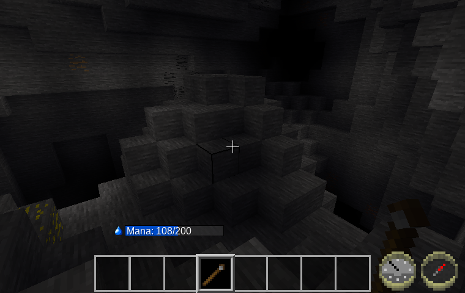
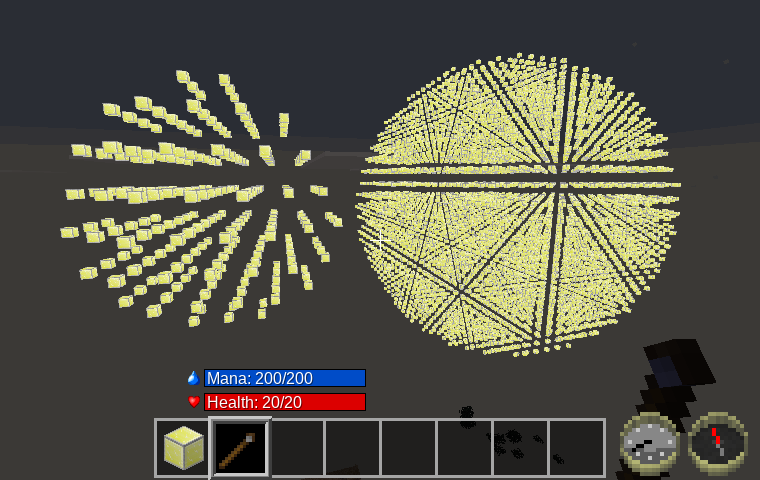

Wand of Illumination [wand\_of\_illumination]
===========================================
Provides a wand that when used lights up an entire room, but only for a moment.

Features
--------

- On right click, places an array of invisible light nodes around the player, in a sphere with a current radius of 15 nodes, and with a light spacing of four nodes.
- On shift-right-click (or aux-right-click), creates an extended sphere of lights with a radius of 30 nodes.
- **New:** Doesn't place lights where already brightly lit.
- Uses node_timers to cause these light nodes to revert back to air nodes after a short amount of time. (However, I left the ABM in as a config option.)
- Uses mana mod if available. Current cost for use is 100 mana (normal), or 200 mana (extended).
- Note that narrow passages, like dungeon corridors, may not light up, if they don't fall on the 4x light spacing grid.

WIP—Things that still need to be done.
----------------------------------

- Come up with a crafting recipe.
- **(Done)** Determine if I should be using an abm or something else.
- Optimize mana cost.
- Tune light generated: brightness, spacing, radius, and decay rate.
- Come up with a better wand texture.
- **(Done)** Maybe add option to give bigger sphere of light on shift-right-click, at the cost of more mana.

Note about number of lights used
--------------------------------
To allow this mod to light up all the narrow twisty tunnels underground, the spacing of the lights placed needs to be as small as possible. However, I also want to minimize how many lights this mod places.  With testing, a spacing of four seemed to give light coverage in most tunnels, with just a few that were too narrow to have any lights.

However, with the fixed spacing I'm using, this still adds up to a large number of lights. I did some tests in the sky, which gives the worst case numbers:

	r = 15,   14000 nodes scanned,   230 lights placed
	r = 30,  113000 nodes scanned,  1760 lights placed
	r = 50,  523000 nodes scanned,  8100 lights placed

On my five-year-old computer, even this last test case only takes a few seconds to generate (in singleplayer), so I'm not too worried about performance. *(Your mileage may vary.)*

Here's a screenshot with r=15 and r=50 (using meselamps to make the lights visible):

Dependencies
------------

- Currently has no default dependency. *(However, I'll probably have to add default when a crafting recipe is added.)*
- Optionally depends on Wuzzy's mana mod. *(Thanks to his Mirror of Returning mod, it was easy to figure out how to add mana support.)*

Licenses
--------

Source code

> The MIT License (MIT)

Media (textures)

> Attribution-ShareAlike 3.0 Unported (CC BY-SA 3.0)

Current wand texture based on farming\_tool\_stonehoe.png by BlockMen
