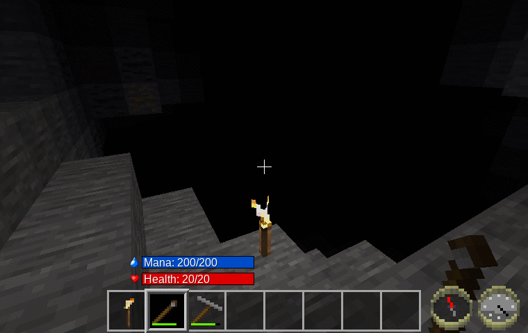
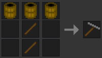

Wand of Illumination [wand\_of\_illumination]
===========================================
Provides a wand that when used, lights up an entire room—but only for a moment.

Alternatively, provides a 1900-era flash-lamp, for those without a sense of magic.

**Picture:** Torch vs Normal vs Extended Range (smooth lighting off)

Features
--------

- **New:** Now with choice of original magic wand or new 1900-era flash-lamp.
- **New:** Changed activation to standard left-click.
- On **left** click, places a sphere of invisible lights around the player with a radius of 15 nodes.
- On shift-**left**-click (or aux-**left**-click), creates an extended sphere of lights with a radius of 30 nodes.
- Doesn't place lights where already brightly lit.
- Uses node_timers to cause these light nodes to gradually fade away.
- **New:** Wear added, so wand and fill-light only work for a limited number of uses. (Currently 20 normal uses, or 10 extended uses.)
- Uses mana mod for wand if available. Current cost for use is 100 mana (normal), or 200 mana (extended).

*(Note that narrow passages, like dungeon corridors, may not light up, if they don't fall on the 4x light spacing grid.)*

WIP—Things that still need to be done.
----------------------------------

- Come up with a crafting recipe. **(Done)** for flash-lamp.
- Optimize number of uses before wearing out.
- Optimize mana cost.
- Tune light generated: brightness, spacing, radius, and decay rate.
- Come up with a better textures.

Note about number of lights used
--------------------------------
To allow this mod to light up all the narrow twisty tunnels underground, the spacing of the lights placed needs to be as small as possible. However, I also want to minimize how many lights this mod places.  With testing, a spacing of four seemed to give light coverage in most tunnels, with just a few that were too narrow to have any lights.

However, with the fixed spacing I'm using, this still adds up to a large number of lights. I did some tests in the sky, which gives the worst case numbers:

	r = 15,   14000 nodes scanned,   230 lights placed
	r = 30,  113000 nodes scanned,  1760 lights placed
	r = 50,  523000 nodes scanned,  8100 lights placed

On my five-year-old computer, even this last test case only takes a few seconds to generate (in singleplayer), so I'm not too worried about performance. *(Your mileage may vary.)*

Here's a screenshot with r=15 and r=50 (using meselamps to make the lights visible):

Dependencies
------------

- Craft recipe for flash-lamp needs default and tnt mods.
- Craft recipe for wand still TBD.
- Optionally depends on Wuzzy's mana mod, for wand.

Craft Recipe
------------

wand = TBD

flash-lamp = 

Licenses
--------

Source code

> The MIT License (MIT)

Media (textures)

> Attribution-ShareAlike 3.0 Unported (CC BY-SA 3.0)

Current textures based on farming\_tool\_stonehoe.png by BlockMen
