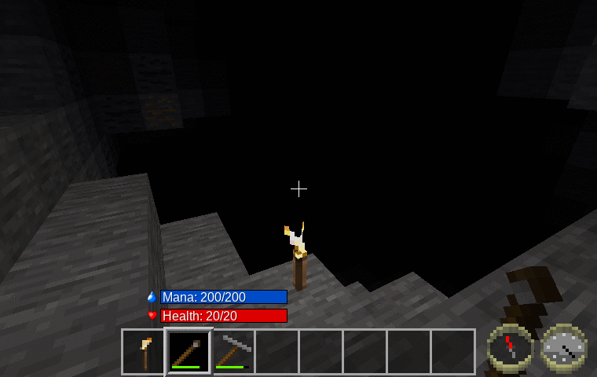
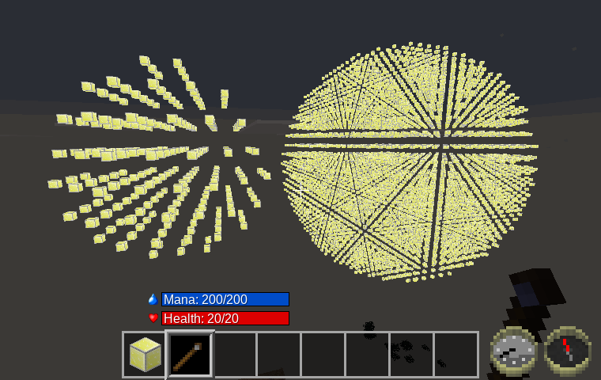
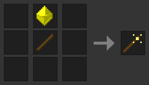
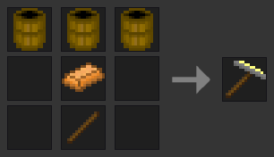
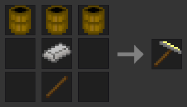
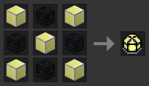

Wand of Illumination [wand\_of\_illumination]
===========================================
Provides a wand that when used, lights up what's in front—but only for a moment.

Alternatively, provides a 1900-era flash\_lamp and a futuristic super\_lamp, for those without a sense of magic.

**Picture:** Torch vs Normal vs Extended Range (smooth lighting off)

Features
--------

- **New:** Now just lights up 120° in direction player is pointed.
- **New:** Choice of original magic wand, 1900-era flash\_lamp, or mese-powered super\_lamp.
- On **left** click, places a cone of invisible lights in front of the player.
- On shift-**left**-click (or aux-**left**-click), creates an extended cone of lights.
- Doesn't place lights where already brightly lit.
- Uses node_timers to cause these light nodes to gradually fade away.
- Wear added, so all lamps will only work for a limited number of uses.
- Uses mana mod for wand if available. Current cost for use is 100 mana (normal), or 200 mana (extended).

*(Note that narrow passages, like dungeon corridors, may not light up, if they don't fall on the 4x light spacing grid.)*

WIP—Things that still need to be done.
----------------------------------

- Come up with a crafting recipes. **(Updated)**
- Optimize number of uses before wearing out. **(Updated)**
- Optimize mana cost.
- Tune light generated: brightness, spacing, radius, and decay rate. **(Updated)**
- Come up with better textures. **(Updated)**

Note about number of lights used
--------------------------------

**Note:** *These numbers were for a full sphere. For r=40 and a 120° cone of light, only 67000 nodes are scanned, and 1044 lights are placed.*

To allow this mod to light up all the narrow twisty tunnels underground, the spacing of the lights placed needs to be as small as possible. However, I also want to minimize how many lights this mod places.  With testing, a spacing of four seemed to give light coverage in most tunnels, with just a few that were too narrow to have any lights.

However, with the fixed spacing I'm using, this still adds up to a large number of lights. I did some tests in the sky, which gives the worst case numbers:

	r = 15,   14000 nodes scanned,   230 lights placed
	r = 30,  113000 nodes scanned,  1760 lights placed
	r = 50,  523000 nodes scanned,  8100 lights placed

On my five-year-old computer, even this last test case only takes a few seconds to generate (in singleplayer), so I'm not too worried about performance. *(Your mileage may vary.)*

Here's a screenshot with r=15 and r=50 (using meselamps to make the lights visible):

Dependencies
------------

- Optionally depends on Wuzzy's mana mod.
- Optionally depends on default and tnt mods to enable craft recipes.

Craft Recipes
-------------

Licenses
--------

Source code

> The MIT License (MIT)

Media (textures)

> Attribution-ShareAlike 3.0 Unported (CC BY-SA 3.0)

Current textures based on farming\_tool\_stonehoe.png by BlockMen
